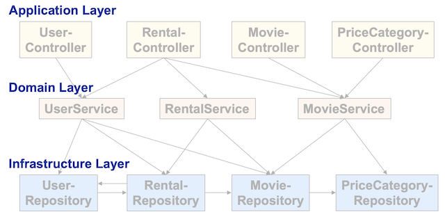
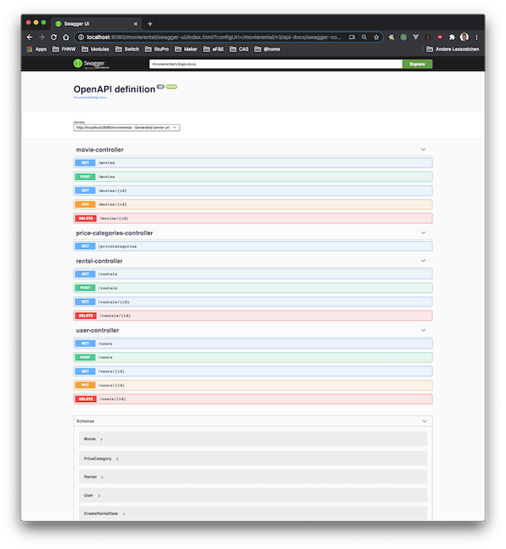

# Lektion 6: "Controller" Design Pattern

## Einleitung
In dieser Lektion werden wir den *Application Layer* (siehe Abbildung 1) unserer *movierental* Enterprise Applikation genauer diskutieren. Dieser  *Application Layer* beinhaltet die verschiedenen Controller Komponenten.  Dabei bildet das [Spring MVC](https://docs.spring.io/spring/docs/current/spring-framework-reference/web.html#mvc) die Basis, um diese Controller Komponenten als Spring Beans zu implementieren und um Features des Spring Frameworks wie *Dependency Injection* nutzen zu können.



Abbildung 1: Layered Architecture mit *Application Layer*s

## Ressourcen
Die Slides zu dieser Lektion gibt es in 2 Versionen:
* eine druckbare Version liegt auf dem AD
* eine vertonte Version finden sie auf diesem [SWITCHtube Channel](https://tube.switch.ch/channels/d7e129eb)

Auch die Arbeitsblätter und Übungen finden sie auf dem AD.

Hier ein paar Links aus dem Internet, die aus meiner Sicht nützlich und aktuell sind:
* [Reference Documentation Spring MVC](https://docs.spring.io/spring/docs/current/spring-framework-reference/web.html#mvc)

## Theorie
Auch in dieser und den weiteren Lektionen wird das [Spring Framework](https://spring.io/projects/spring-framework) mit [Spring MVC](https://docs.spring.io/spring/docs/current/spring-framework-reference/web.html#mvc) und [Spring Boot](https://spring.io/projects/spring-boot) intensiv eingesetzt. Diese Technologien werden für den Rest des Moduls unsere Basis bilden, um _Java Enterprisee Applications_ mit _RESTful API_ schnell und effizient implementieren zu können. Es ist deshalb wichtig, dass ihr euch mit diesen Technologien vertraut macht. Sie basieren auf dem _Servlet API_ und nutzen die Basiskomponenten _Servlet_, _Filter_, _Listener_. Diese Basiskomponenten werden aber ausschliesslich vom Spring Framework verwendet. Dem Entwickler steht schlussendlich eine Umgebung in Form des *Spring Container* mit all seinen Features zur Verfügung, welche das *Servlet API* komplett abstrahiert.

Da aber Enterprise Applikationen oft als *RESTful Webservice* mit einem entsprechenden API implementiert werden, ist es für den Entwickler wichtig, dass er den gesamten Pfad eines Requests und der entsprechenden Response kennt und versteht wie die verschiedenen Kompententen einer Enterprise Applikation den Request und Response verarbeiten.

Auch in diesem Kontext konnte man diverse Design Patterns als *Best Practices* formulieren. Hier ein paar Links zu den verschiedenen Design Patterns auf der Website von [Martin Fowler](https://www.thoughtworks.com/de/profiles/martin-fowler):

* [Model View Controller](https://martinfowler.com/eaaCatalog/modelViewController.html)
* [Front Controller](https://martinfowler.com/eaaCatalog/frontController.html)
* [Page Controller](https://martinfowler.com/eaaCatalog/pageController.html)
* [Richardson Maturity Model](https://martinfowler.com/articles/richardsonMaturityModel.html#TheMeaningOfTheLevels) mit Referenz auf einen [Talk](https://www.crummy.com/writing/speaking/2008-QCon/act3.html) von Richardson 

Wichtig ist, dass sie diese Patterns zu den Komponenten von [Spring MVC](https://docs.spring.io/spring/docs/current/spring-framework-reference/web.html#mvc) zuordnen können und dass sie die Funktionsweise von Spring verstehen und erklären können.

* Welche Rolle spielt das [DispatcherServlet](https://docs.spring.io/spring/docs/current/spring-framework-reference/web.html#mvc-servlet)? Wann wird es gestartet? Wie wird es gestartet?
* Welches sind die Page Controller? Wie und warum werden sie gestartet?
* Ist ein Page Controller bei Spring MVC ein Servlet?
* Wieviele Servlets gibt es in einer Spring MVC Applikation
* Was ist der Endpoint für einen HTTP Request bei einer Spring MVC Applikation?
* Welche Rollen spielen in einer Spring MVC Applikation:
    * Web Server?
    * Servlet Container?
    * Spring Container?

## Arbeitsblätter und Übungen
**Arbeiten sie in einem 2er-Team. Es macht mehr Spass!**

### AB1
In Aufgabe 1 nutzen sie OpenAPI Spezifikation, um ihre Server Applikation zu visualisieren und zu dokumenieren. Über das entsprechende Swagger-UI erhalten sie zusätzlich einen interaktiven Zugang zur Server Applikation (siehe Abbildung 2).



Abbildung 2: Swagger-UI der Server Applikation *movierental.jpa*

Mit diesem Arbeitsblatt werden sie:

- Property *context-path* in `application.properties` nutzen.
- Einsatz Annotationen `@RequestMapping`, `@RestController` und `@RequestBody` vertiefen.
- Eisnatz Annotation für Input Parameter `@RequestParam` und `@PathVariable` vertiefen.
- Übergang *Servlet Container* zu *Spring Container* kennenlernen, d.h. das `DispatcherServlet` als FrontController und Einstieg in die Spring Applikation.

**Hinweis**: 
* Um das Mapping, das durch die Annotationen `@RequestMapping` konfiguriert wird, sichtbar zu machen, müssen sie im File `application.properties` folgende Property setzen:

    ```
    logging.level.web=trace
    ```

### UB1
In dieser Übung (Hausaufgabe) erweitern sie die Controller aus AB1, so dass der Level 2 des [Richardson Maturity Model](https://martinfowler.com/articles/richardsonMaturityModel.html) implementiert ist. Dieses Model zeigt, wie gut das REST Konzept umgesetzt ist. Dabei bedeutet der Level 3 die volle Umsetzung des REST-Konzepts nach [Roy Fielding](https://www.ics.uci.edu/~fielding/pubs/dissertation/rest_arch_style.htm).

**HTTP Status Code**: Um diesen Level 2 implementieren zu können, müssen sie mit jeder Response auch den [HTTP Status Code](https://de.wikipedia.org/wiki/HTTP-Statuscode) mitgeben. Dieser Status Code ist wichtig, damit die Clients die korrekte Ausführung des entsprechenden HTTP-Request effizient beurteilen können, bevor die eigentliche Response (=Payload) verarbeitet werden muss. Die HTTP Response kann deshalb aus 2 Teilen bestehen:
1. HTTP Status Code
2. Response (normalerweise im Format JSON)

Um eine solche Response generieren zu können, stellt SpringMVC die Klasse [ResponseEntity](https://docs.spring.io/spring-framework/docs/current/javadoc-api/org/springframework/http/ResponseEntity.html) bereit.

**Validierung**: Es ist wichtig, dass die Enterprise Applikation möglichst schnell Input-Fehler erkennen kann, bevor z.B. die Datenbank angesprochen wird oder eine fehlerhafte Entität zu einer Inkonsistenz im Datenbestand führt. JavaEE hat dafür das Validation Framework [JSR-380](https://jcp.org/en/jsr/detail?id=380) in der Version 2 spezifiziert ([JSR-303](https://jcp.org/en/jsr/detail?id=303) entspricht Validation Framework 1.0). Spring hat diese Validierung in seinem Framework eingebaut: [Java Bean Validation](https://docs.spring.io/spring-framework/docs/current/spring-framework-reference/core.html#validation-beanvalidation).

Nutzen sie *Java Bean Validation* von Spring, um die Input-Parameter in den Handler-Methoden zu überprüfen und in einem Fehlerfall mit der entsprechenden Response zu reagieren. Beachten sie, dass dab Spring Boot 2.3 die Validierung explizit als Dependency im File `build.gradle` eingebunden werden muss:

```
implementation 'org.springframework.boot:spring-boot-starter-validation'
```

**Hinweise**:
- Trotz Konformität zu Level 2 (gemäss des *Richardson Maturity Model*) stellt die Enterprise Applikation noch **KEIN RESTful API** im Sinne von Roy Fielding zur Verfügung. Es fehlen die Hyperlinks in der Responses, d.h. die Umsetzung des [HATEOAS](https://en.wikipedia.org/wiki/HATEOAS) Konzepts.
- Roy Fielding erklärt im Blog-Post [REST APIs must be hypertext-driven](https://roy.gbiv.com/untangled/2008/rest-apis-must-be-hypertext-driven) die Hintergründe von HATEOAS. Interessante Lektüre!
- Das Spring Tutorial [Building REST services with Spring](https://spring.io/guides/tutorials/bookmarks/) beschreibt die Implementation einer Enterprise Applikation hin zu zu einem RESTful Service ausführlich - und kann als anschauliches Beispiel empfohlen werden.