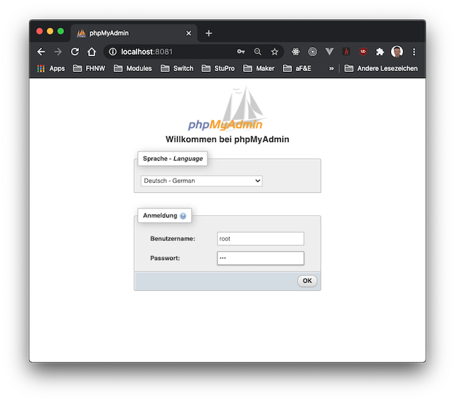
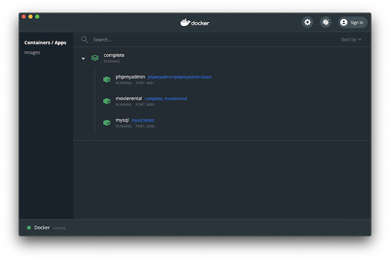

# Lektion 7: Containerisierung von Enterprise Application

## Einleitung
In dieser Lektion wollen wir unsere *movierental* Enterprise Applikation für den Einsazt in einem *produktiven Umfeld* ausbauen. Für diesen Ausbau werden wir folgende Schritte vornehmen.  
* Containerisierung vornehmen, um die verschiedenen Server-Komponenten mit einer einheitlichen Laufzeitumgebung bereitstellen zu können.
* Aussagekräftiges Logging einführen, um das Laufzeitverhalten nachverfolgen zu können.
* Eine externen Datenbank nutzen, so dass die persistierten Daten einen Restart der Applikation überleben können.

## Ressourcen
Die Slides zu dieser Lektion gibt es in 2 Versionen:
* eine druckbare Version liegt auf dem AD
* eine vertonte Version finden sie auf diesem [SWITCHtube Channel](https://tube.switch.ch/channels/d7e129eb)

Auch die Arbeitsblätter und Übungen finden sie auf dem AD.

## Theorie
Eine Einführung in Docker erhält man mit [Docker for beginners](https://docker-curriculum.com/#introduction). Dabei sind die folgende Kapitel sinnvoll für den Einstieg:
* [Introduction](https://docker-curriculum.com/#introduction)
* [Getting Started](https://docker-curriculum.com/#getting-started)
* [Hello World](https://docker-curriculum.com/#hello-world)

Spring stellt 2 Guides zur Verfügung, die Spring Boot und Docker behandeln:
* Getting Started Guide [Spring Boot with Docker](https://spring.io/guides/gs/spring-boot-docker/) (15-30min)
* Topical Guide [Spring Boot Docker](https://spring.io/guides/topicals/spring-boot-docker/) (ca. 60min)

Sie sollen in dieser Lektion über das praktische Arbeiten ein Verständnis für die Containerisierung mit Docker aufbauen und die Konzepte hinter den folgenden Begriffen verstehen:

* Virtualisierung
* *Layer* im Kontext von Docker
* Image
* Container

## Arbeitsblätter und Übungen
**Arbeiten sie in einem 2er-Team. Es macht mehr Spass!**

### AB2
Ein aussagekräftiges Logging ist für das Verständnis des Laufzeitverhaltens einer Enterprise Applikation sehr wichtig. Sie werden in diesem Arbeitsblatt ein solches Logging implementieren. Nutzen sie dabei die Information aus [Spring Boot Logging](https://docs.spring.io/spring-boot/docs/current/reference/html/spring-boot-features.html#boot-features-logging).

Folgende Anforderungen sind umzusetzen:
* Log-Meldungen in ein externes Logfile schreiben.
* Log-Meldungen geben den aktuellen State der Applikation wieder.

### AB3
In dieser Aufgabe werden sie Docker nutzen, um [MySQL](https://www.mysql.com) und [phpMyAdmin](https://www.phpmyadmin.net/) auf ihrem Computer zu installieren. Dabei werden sie das `docker` Tool nutzen, um `MySQL` und `pypMyAdmin` zu laden und zu starten:

```shell
$ docker pull mysql:latest 
$ docker run --name mysql -p 3306:3306 -e MYSQL_ROOT_PASSWORD=eaf -d mysql

$ docker pull phpmyadmin/phpmyadmin:latest 
$ docker run --name phpmyadmin -d --link mysql:db -p 8081:80 phpmyadmin/phpmyadmin
```

**Hinweis**: Passen sie ihre Befehle an ihr Setup an, wie Password, Ports oder auch Datenbank-Name.

Sie können anschliessend die Datenbank über die Webapplikation `phpMyAdmin` administrieren (siehe Abbildung 1).



Abbildung 1: Login Page von `phpMyAdmin` auf `localhost:8081`

Die Enterprise Applikation `movierental.jpa` müssen sie an diesen *produktiven* Betrieb anpassen. Sie können dies am einfachsten über die Einführung eines neuen [Spring Profiles](https://docs.spring.io/spring-boot/docs/current/reference/html/spring-boot-features.html#boot-features-profiles) erreichen, z.B. `prod`. 

Die Applikation wird noch nicht in einem Docker Container gestartet, sondern noch normal über Gradle - jedoch mit dem entsprechenden Profil `prod`:

```shell
$ ./gradlew bootRun --args='--spring.profiles.active=prod'
```

### UB2
In dieser Übung wird der Umgang mit Docker vertieft, indem sie:
1. für die Enterprise Applikation `movierental.jpa` ein Docker Image erstellen.
2. `docker-compose` nutzen, um alle Komponenten der Enterprise Applikation, bestehend aus der Datenbank `MySQL`, dem DB-Administrationstool `phpMyAdmin` und der Enterprise Applikation `movierental.jpa` selber, als Docker-Container gleichzeitig zu definieren und zu starten.

Für die Kommunikation zwischen den Container zu ermöglichen, ist es wichtig ein Verständnis für das *Networking* zu erarbeiten. Es stellt sich z.B. die Frage was ist `localhost` innerhalb eines Containers!

Mehr zum Thema *Networking* finden sie unter:
* [Container networking](https://docs.docker.com/config/containers/container-networking/)

Vor allem am Anfang ist *Docker Networking* komplex, um die einzelnen Container korrekt in ein gemeinsames Netzwerk einzubinden. Man muss z.B. folgenden Befehl absetzen, um das Image `movierental` als Container `server` in das Netzwerk `complete_default` einzubinden:

```shell
% docker run -p 8080:8080 --volume=/tmp:/tmp -e SPRING_PROFILES_ACTIVE=prod --name=server --network complete_default movierental
```

Mit `docker-compose` wird das einfacher!

Für einen Einstieg in `docker-compose` können sie folgende Ressourcen nutzen:
* [Docker Tutorial](https://www.youtube.com/watch?v=i7ABlHngi1Q) von 30min - 40min
* [Overview of Docker Compose](https://docs.docker.com/compose/)

Ziel ist es, dass die gesamte Applikation über Docker verwaltet werden kann (siehe Abbildung 2).



Abbildung 2: Docker Dashboard auf einem Mac mit den Container für `MySQL`, `phpMyAdmin`, `movierental.jpa`