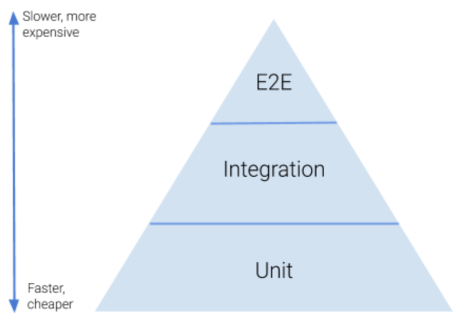

# Lektion 12: Testing
In dieser Lektion legen wir den Fokus auf das *Testing* einer Enterprise Applikation. Dabei werden wir uns nicht nur auf das *Unit Testing* beschränken, sondern auch das *Integration Testing* nutzen, um die Server Applikation als Gesamtsystem mit all seinen Komponenten testen zu können.

Es geht in dieser Lektion um folgende Fragen:
* Wie kann man das API der Enterprise Application testen?
* Wann ist welche Testart (Unit vs. Integration Tests) sinnvoll?
* Wie geht man mit Abhängigkeiten innerhalb der zu testenden Klasse um?
* Wie schreibt man effiziente Tests?

## Einleitung
Testen ist ein integraler Bestandteil bei der Entwicklung von Enterprise Applikationen. Das *Testing* spielt deshalb beim Spring Framework seit Beginn eine zentrale Rolle und die entsprechende Unterstützung ist über ausgereifte Test-Bibliotheken sehr gut ausgebaut. 

Spring unterscheidet dabei 2 Arten von Test-Methoden:
* [Unit Testing](https://docs.spring.io/spring-framework/docs/current/reference/html/testing.html#unit-testing)
* [Integration Testing](https://docs.spring.io/spring-framework/docs/current/reference/html/testing.html#integration-testing)

## Ressourcen
Die Slides zu dieser Lektion gibt es in 2 Versionen:
* eine druckbare Version liegt auf dem AD
* eine vertonte Version finden sie auf diesem [SWITCHtube Channel](https://tube.switch.ch/channels/d7e129eb)

Auch die Arbeitsblätter und Übungen finden sie auf dem AD.

## Theorie
Der Begriff *Test Pyramide* (Abb. 1) ist eine Metapher, die besagt, dass man Softwaretests in Levels mit unterschiedlicher Granularität grupperien soll. Der Begriff gibt eine Vorstellung, wie viele Tests man in jedem dieser Level schreiben sollte.

Abb. 1: Die *Test Pyramide* mit den 3 unterschiedlichen Levels 

Bezüglich der *Test Pyramide* kann man sich an folgende 2 Regeln orientieren:
1. Tests sind in unterschiedlicher Granularität; Tests, die eine kleine Komponente testen versus Tests, die das Zusammenspiel von verschiedenen Komponenten testen.
2. Je höher im Level, desto weniger Tests gibt es; Tests in einem höheren Level sind umfassender, deshalb aufwändiger und zeitintensiver.

Hier ein paar wenige Links aus dem Internet:
* Artikel von Martin Fowler: [The Practical Test Pyramid](https://martinfowler.com/articles/practical-test-pyramid.html)
* Spring Guide [Testing the Web Layer](https://spring.io/guides/gs/testing-web/)

In dieser Lektion werden wir Tests für die beiden unteren Levels schreiben und dabei das Test-Framework von Spring in unterschiedlichen Ausprägungen kennenlernen.

## Arbeitsblätter und Übungen
**Arbeiten sie in einem 2er-Team. Es macht mehr Spass!**

### UB12
Gegeben ist je eine Testsuite für Unit- und Integration-Testing mit dem Spring Test Framework. Die Testsuites enthalten jeweils einen fehlerfrei ausführbaren Test. Bei weiteren Testmethoden fehlt die Testlogik. Diese müssen sie implementieren.

Der Fokus der Tests liegt auf dem `Application Layer` und hier bei der Verwaltung der `User`, d.h. dass die Testsuite nicht vollständig ist.

Ausgangspunkt ist das Projekt im Ordner `ub12/initial/movierental.jpa`.
